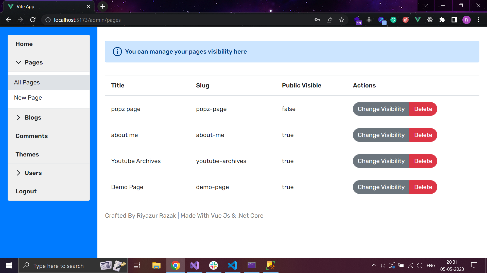

# MINI Content Management System

## Tech Stack

- Vue JS 3 (composition api)
- Asp.Net Core With EF 6
- Sql Server
- Sendgrid Email Service
- MFA

## Features

- Role based admins
- Multi factor Authentication for admins (google authenticator app)
- Rich Text editor to create contents
- No Code Page builder to create pages
- Awesome themes to customize
- comments and likes for blog posts

## Snapshots (Admin)

## Snapshots

